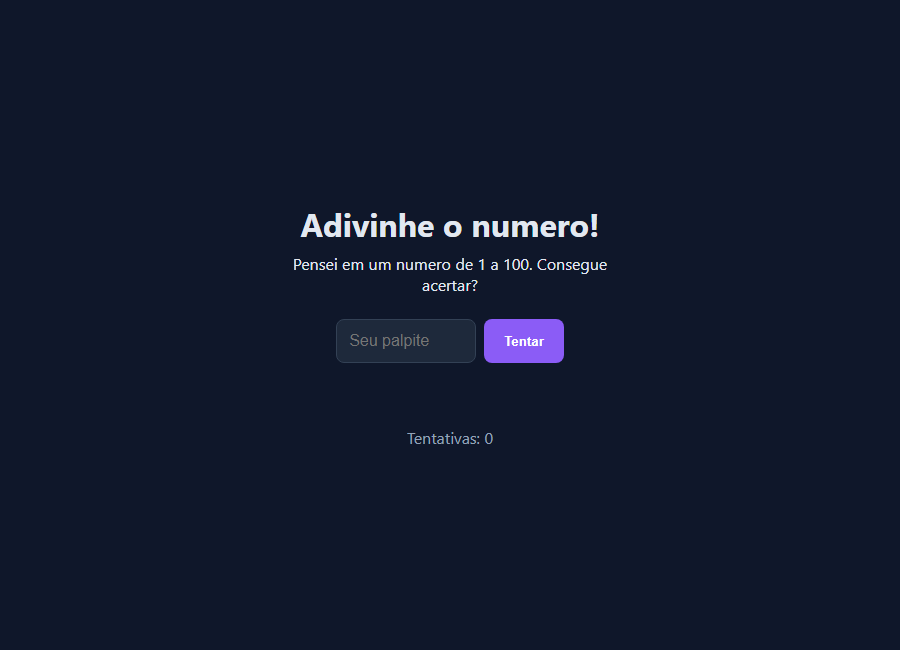

# Adivinhe o Número

Jogo web em que o usuário tenta descobrir um número secreto entre 1 e 100, recebendo dicas a cada palpite.

---

## Sobre

Projeto front-end para praticar lógica com JavaScript, manipulação de formulários, condicionais e feedback visual dinâmico.

**Autora:** Shalana Xavier  
**GitHub:** [@shalana-dev](https://github.com/shalana-dev)

---

## Demonstração


| Início | Dica | Vitória |
|--------|------|---------|
|  |  |  |

---

## Funcionalidades

- Geração aleatória de número entre 1 e 100
- Campo de palpite com validação HTML
- Dicas: **maior**, **menor** ou **acertou**
- Contador de tentativas
- Cores diferentes para cada tipo de feedback
- Botão para jogar de novo após acertar

---

## Tecnologias

- HTML5
- CSS3
- JavaScript (Vanilla)

---

## Como rodar

```powershell
git clone https://github.com/shalana-dev/adivinha.git
cd adivinha
```

Abra o `index.html` no navegador (duplo clique ou Live Server).

> Não precisa de `npm install`.

---

## Estrutura de pastas

```text
adivinha/
├── assets/         # Prints e GIF
├── index.html
├── style.css
├── script.js
├── scripts/        # Script de captura de mídia
├── .gitignore
└── README.md
```

---

## Aprendizados

- `Math.random()` e `Math.floor()`
- `preventDefault()` em formulários
- Manipulação de classes CSS com `classList`
- Estados visuais com feedback ao usuário

---

## Melhorias futuras

- [ ] Implementar lógica do botão "Jogar de novo"
- [ ] Melhor de tentativas com `localStorage`
- [ ] Deploy com GitHub Pages

---

## Licença

Projeto pessoal — © Shalana Xavier.
